# PyQt4 做的一些小玩意儿

## 基于 PyQt4 和 python2.7 写的2048小游戏

实现的功能：

1. 初始化，2-3个色块，值为2或4，出现的概率的四比一。

2. 每次移动且色块的位置有变化且有空闲区域才会有新色块产生，值为2或4，出现的概率为九比一。

3. 每一次移动都会在指定方向上遍历匹配相同值的色块，然后已有的两个相同值的色块消失，产生新的色块，其值为两个相同色块值之和。如果在产生新的色块之后，在同方向上有相同值的色块，此时并不匹配消失。

4. 每一次移动之后都会对全体色块进行一次轮询，判断是否已满且在上下左右四个方向上都没有相邻的相同的色块，若是即游戏结束。

5. 按下Escape键即重置游戏，也可以按RESET按钮重置游戏。

6. 计分栏累加每次产生的新色块的值

7. 最高分统计游戏最高分

游戏截图：

Windows:

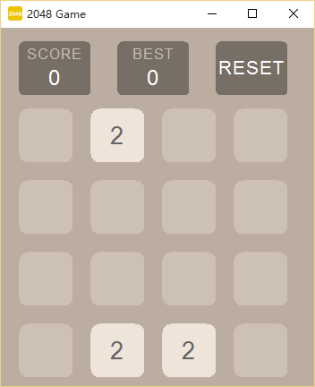

Ubuntu:

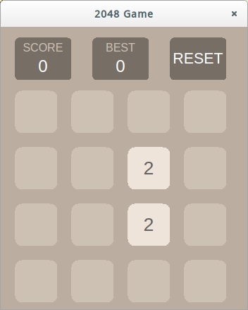

## 基于 PyQt4 和 Python2.7 的贪吃蛇小游戏

实现的功能：

1. 空格键(Space)开始，确认(Enter)键暂停，退出(Escape)键重新开始

2. 自定义是否可以穿墙和游戏难度，游戏难度从1到100

游戏截图：

Windows：

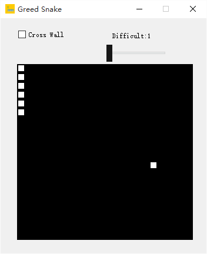

Ubuntu：

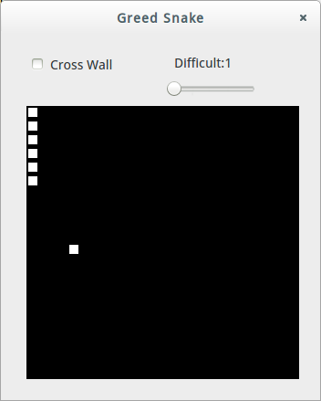

## 基于 java1.8 和 swing 的2048小游戏

实现的功能：

1. 按 Esc 键重新开始

游戏截图：

Windows：

Ubuntu：

## 基于 PyQt4 和 Python 2.7 的计算机网络回退 N 帧 ARQ 协议

回退 N 帧 ARQ (Automatic Repeat reQues ，自动重传请求) 协议，发送端不需要接收到上一个数据包的 ACK 后才发下一个数据包，而是可以连续发送一定数量的数据包，若在一定时间内未收到返回的 ACK 或收到错误的 ACK ，则将这一定数量的数据包全部重发。

回退 N 帧协议也是属于滑动窗口协议，发送房的滑动窗口大小为 N ，接收方的滑动窗口为 1 。

停等协议即滑动窗口大小为 1 的 回退 N 帧协议

实现的功能：

1. 可以改变发送信息

2. 可以改变窗口大小

运行截图：

Windows：

服务器端 ：

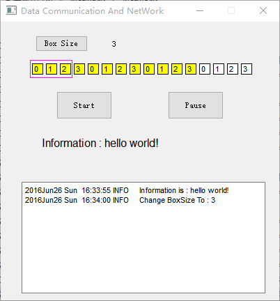

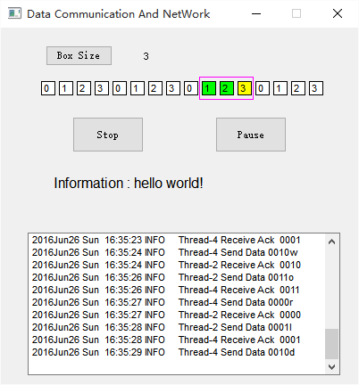

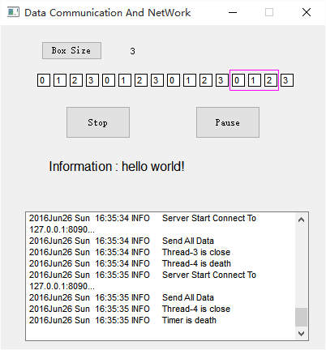

客户端：

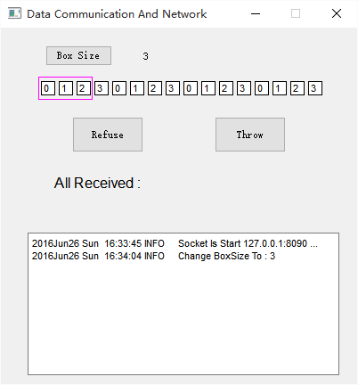

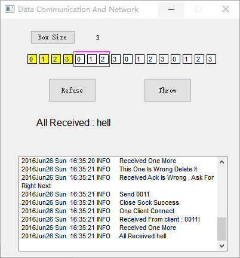

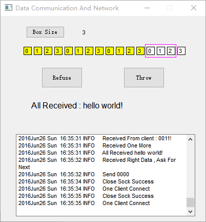

Ubuntu：

服务器端：

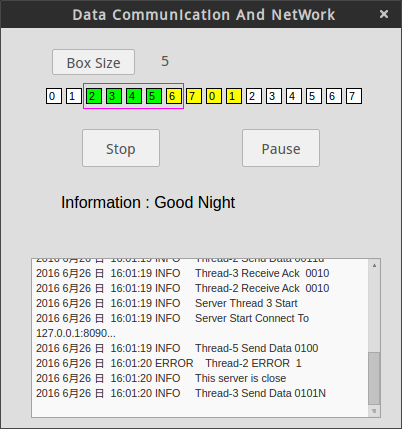

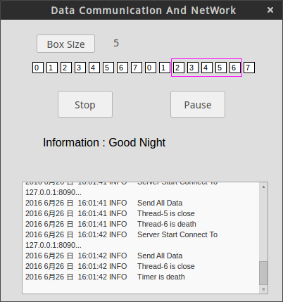

客户端：

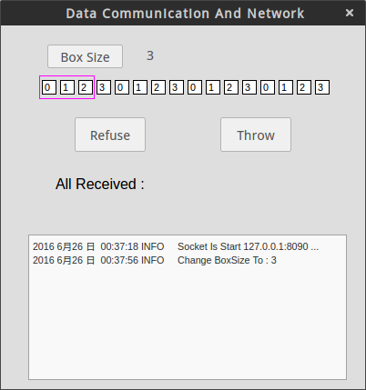

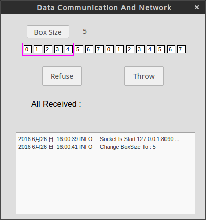

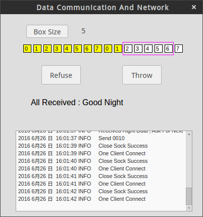
