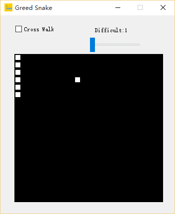
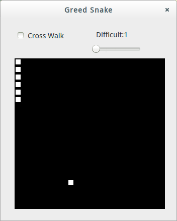
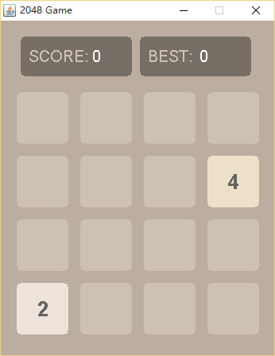
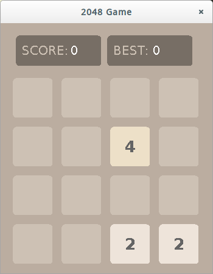

#This is 2048 Game by PyQt4

这是基于PyQt4和python2.7写的2048小游戏

实现的功能：

1. 初始化，2-3个色块，值为2或4，出现的概率的四比一。

2. 每次移动且色块的位置有变化且有空闲区域才会有新色块产生，值为2或4，出现的概率为九比一。

3. 每一次移动都会在指定方向上遍历匹配相同值的色块，然后已有的两个相同值的色块消失，产生新的色块，其值为两个相同色块值之和。如果在产生新的色块之后，在同方向上有相同值的色块，此时并不匹配消失。

4. 每一次移动之后都会对全体色块进行一次轮询，判断是否已满且在上下左右四个方向上都没有相邻的相同的色块，若是即游戏结束。

5. 按下Escape键即重置游戏，也可以按RESET按钮重置游戏。

6. 计分栏累加每次产生的新色块的值

7. 最高分统计游戏最高分

游戏截图：

Windows:

Ubuntu:

基于PyQt4和Python2.7的贪吃蛇小游戏

实现的功能：

1. 空格键(Space)开始，确认(Enter)键暂停，退出(Escape)键重新开始

2. 自定义是否可以穿墙和游戏难度，游戏难度从1到100

游戏截图：

Windows：

Ubuntu：

基于java1.8 和swing的2048小游戏

实现的功能：

1. 按Escape键重新开始

游戏截图：

Windows：

Ubuntu：

